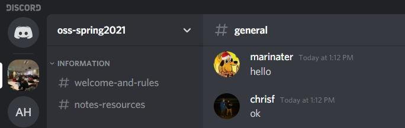

# Lab 01 Report - Introduction to Open Source Software

## Discord Hello Message

## Reading Assignments
#### Open Source Definition
I found this reading to be really helpful in understanding what, at it's core, all Open Source projects abide by. Regardless of the specific liscence, these 10 points define what it means to be Open Source and by extension, why we should care about Open Source projects as both developers and users. I found the "License Must Not Restrict Other Software" clause to be both unexpected but incredibly powerful, since it acknowledges the fact that open source software works best in an ecosystem that empowers users to make design decisions for themselves as opposed to having them forced onto them.
### How to Ask Questions the Smart Way
I found this to be pretty interesting since I found many of things listed to be things I do without thinking, and others to be points I should be take more careful consideration of when asking on forums. In particular, I liked the "describe the goal, not the step" section because I find myself jumping into implementation details when it isn't needed sometimes
### Hot to Answer Questions
1. Ignore rudeness (to an extent). Sometimes people come off that way accidentally and other times they are exactly as rude as they mean to be. Either way, try to see past the rudeness to help others who stumble across the post and are looking for an answer, not a rant on manners.
2. Read the question and, more importantly, *understand* the question being asked. There are often finer points you can miss that completely change how the solution has to be approached.
## Free Culture
The chapter overall gives an introduction to piracy and how the internet sparked fierce debate over what were mostly settled copyright issues. What I thought was really interesting was how copyright law originally dealt with only publishing. Since the act of publishing itself was expensive, it inherntly limited it to commerical entities, making it easy for the government to rule on and enforce copyright claims. However, the internet changed that by making it just as easy for a single person to distribute information as an entire publishing company. And unlike large commercial entities, individuals are far more numerous and make it much more difficult to enforce the same copyright rules that worked well previously. Another caveat is that the internet makes much more creative content susceptible to copyright claims, and in a way serves as an anti-competition measure that protects certain industries at the expense of individuals.

## Tree

## Regex Practice

## Regex Crosswords

## Blocky

## Reflection
Two Open Source projects that really interest me are React and Recoil.js. I really enjoy using both of these projects and think contributing to them could give me a deeper understanding of how they work internally. Additionally, these are big projects and I know there are a lot of features that could be expanded on or bugs that need fixing.
