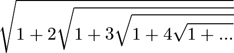

## Part 1 - Documentation

[Project Ideas Wiki Link](https://github.com/marinater/oss-repo/wiki/Project-Ideas)

## Part 2 - Community

[Gitstats + Gource for RCOS projects](https://docs.google.com/document/d/1VEmo2LpjfwZb5kb3il-Ar6woIRWM-V78JpDyJaIBDwY/edit)

### Comments

There are definitely some differences in the way gitstats counts contributors and the way we found contributors (by looking at the repo on Github). For some repos, it undercounts, and for other repos, it overcounts, so there may be subtle differences like whether contributors that don't have changes on master or whether to merge authors that have the same email.

One thing that I really like about gitstats is that it shows not only how many lines of code there are but also how many deletions there are. I think this is a really cool stat because it really shows the code evolves over time and that there's a good chance that what you write one day will be improved or built upon in the future.

