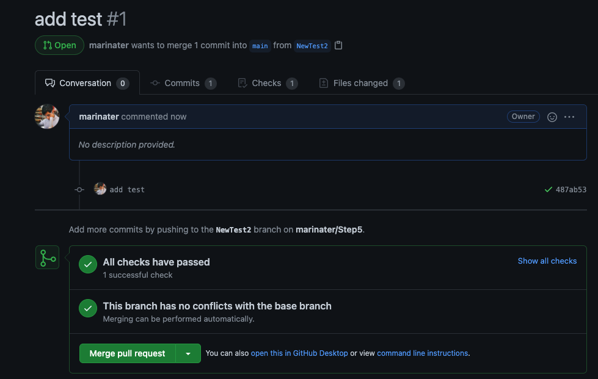

Samarth Patel

# Lab 7

## Checkpoint 1: Getting started

## Checkpoint 2: Executing the tests

### Part 1

- The cdash link provided links to a dashboard that has one row for each build. Builds that have failed tests have the 'Fail' column of the table highlighted in red with a nonzero entry indicating how many tests failed. You can click on this text (it's a hyperlink) and it will take you to another page that displays the exact test cases that failed. Example of one of these pages can be found [here](https://open.cdash.org/viewTest.php?onlyfailed&buildid=7133522)
- The link I included above has 3 failures. You can see the overall error condition by looking in the 'Details' column. One of them says timeout, which could be indicative of a process hanging for some reason. More details can be found by clicking the name of tests in the 'Name' column (they are hyperlinks). This will take you to a page of the actual test output, which can more easily help debug what went wrong without having to run the test locally. Doing this, I found that one of the tests (found [here](https://open.cdash.org/test/375121710)) is failing because a cmake file has incorrect syntax.
- I found a `macOS-make` build that has 1 failing test (found [here](https://open.cdash.org/test/374952993?graph=Processors)). The error is that one test is NOT timing out when it is expected that it does. This does not overly concern me, but someone with more familiarity contributing to CMake would have better knowledge of how critical this test is. Otherwise, the mac builds are fairly green across the board.

### Part 3

There are no errors in the build.

### Part 4

[Link to submission](https://open.cdash.org/build/7134756)

## Checkpoint 3

The fix was to simply change the copyright year from 2000-2020 to 2000-2021

After this change, the tests ran successfully

### Checkpoint 4

Repo (with updated readme): https://github.com/marinater/Step5

After adding a test

## Checkpoint 5

