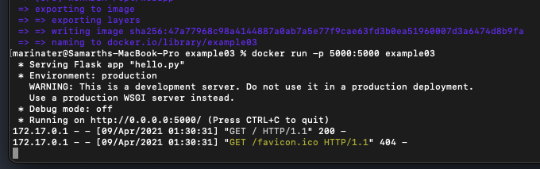
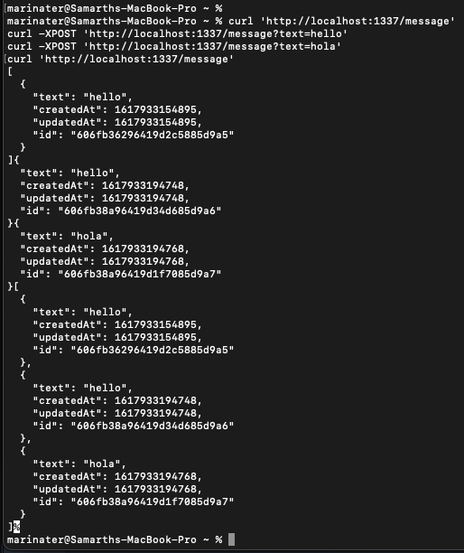

Samarth Patel

# Lab 8: Virtualization and Docker

## Example 0


## Example 1

```
docker run -it ubuntu bash
apt update
yes | apt install vim
yes | apt install cowsay
su
cowsay
```


## Example 2

```
docker run --name db -d mongo:3.2 mongod --smallfiles

docker run --name rocketchat -p 3000:3000 --env ROOT_URL=http://localhost --link db:db -d rocket.chat

docker ps
docker images

```


After stopping container, removing container, and then removing all images


## Example 3

```
docker build -t example03 .
docker run -p 5000:5000 example03
```




## Example 4

```
docker build -t message-app .
docker images
docker run message-app

docker-compose build
docker-compose up

curl 'http://localhost:1337/message'
curl -XPOST 'http://localhost:1337/message?text=hello'
curl -XPOST 'http://localhost:1337/message?text=hola'
curl 'http://localhost:1337/message'
curl -XPUT 'http://localhost:1337/message/606fb36296419d2c5885d9a5?text=hey'
curl -XDELETE 'http://localhost:1337/message/606fb36296419d2c5885d9a5'
curl 'http://localhost:1337/message'
```




