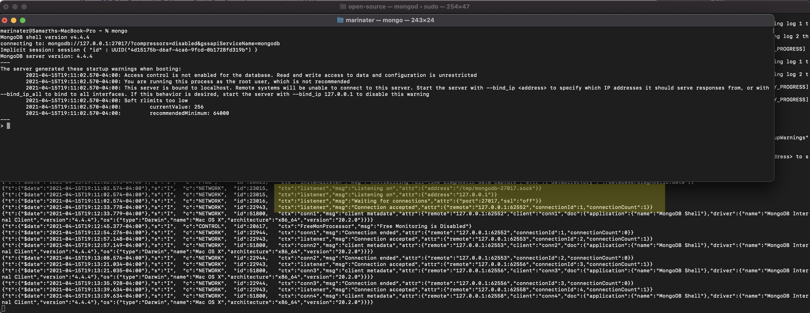
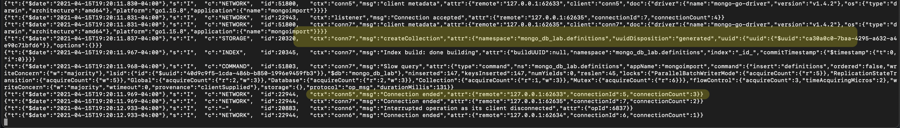
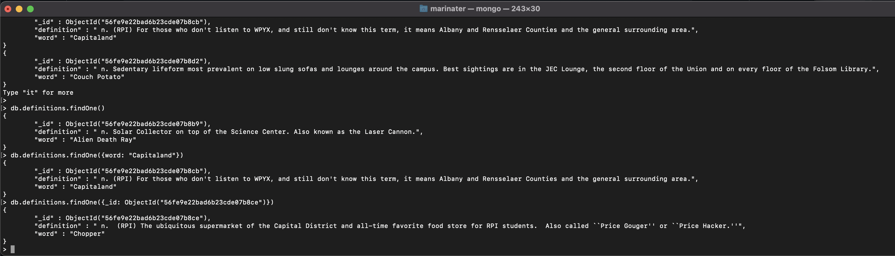
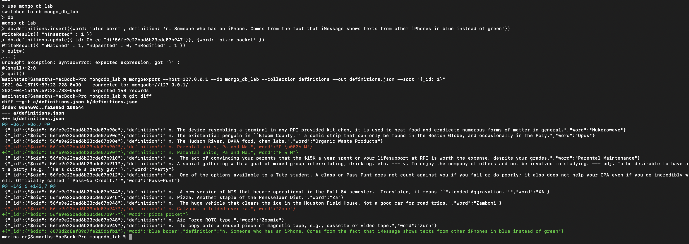
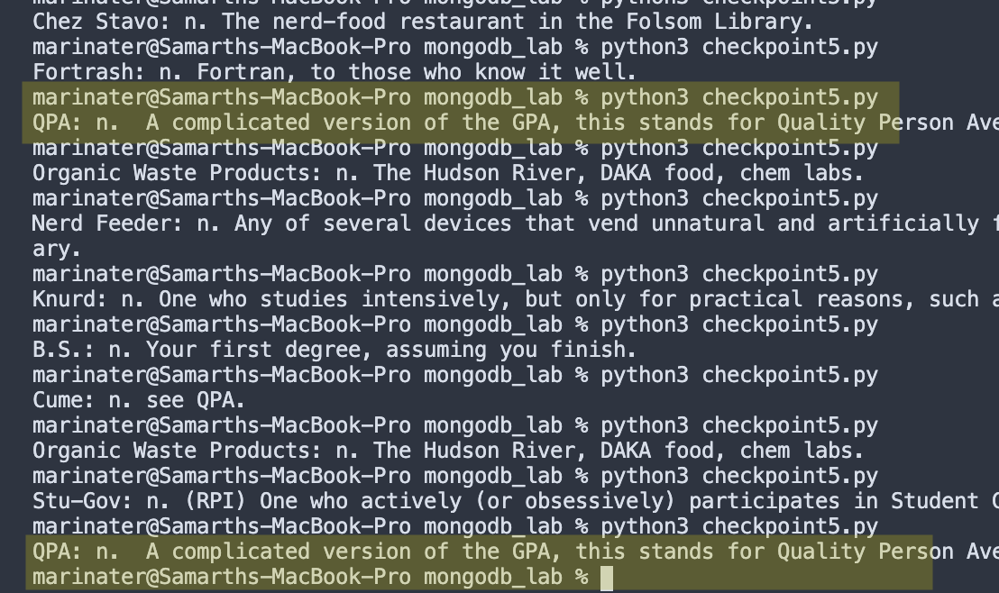
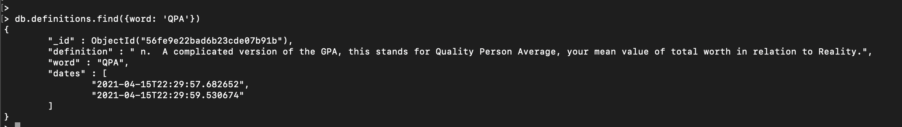

Samarth Patel

# Lab 9

## Checkpoint 0

The topic I found most interesting was the Google v. Oracle supreme court case on the fair use of APIs. Overall, I think that this ruling strikes a really good balance between protecting Open Source projects and protecting companies. The reason for this is that the ruling is based entirely on the concept of Fair Use which takes into account several factors. These factors are

-   How transformative the work is
-   The purpose for copying
-   How much was copied
-   The effect of copying on the original work

These factors strike a fine balance between giving Open Source projects strong legal protections and allowing companies to make money off the works they create. Open Source projects that try to create free versions of existing products will have a much harder, but not unreasonable, time defending themselves than Open Source projects that do something fundamentally transformative with the API.

Notably, the case does not answer the question of whether APIs can be copyrighted. The arguments in the ruling are entirely based on the fact that even if Oracle had a copyright on the API, Google's use is fair.

The court's decision to not answer the question at this time was reasonable since it leaves it open for technology to develop further and more informed decisions be made if needed. However, I think that in the meantime, this will have an impact on Open Source projects because it means that courts cannot dismiss these types of cases immediately. Even if a project is using an API in a way that falls under Fair Use, the case would have to be examined in court, which could be cost prohibitive for an Open Source project and in the best interest for big companies with legal teams. On the other hand, if APIs were flat out not copyrightable, the case would be dismissed immediately and not put Open Source projects under that burden.

Overall, however, I feel that this ruling is a well informed one and am happy that the Supreme Court was able to reach this conclusion given the technical nuance involved.

## Checkpoint 1



## Checkpoint 2




## Checkpoint 3





## Checkpoint 4

```
from bson.objectid import ObjectId
from pprint import pprint
from pymongo import MongoClient

client = MongoClient()

if __name__ == '__main__':
    db = client.mongo_db_lab
    definitions = db.definitions

    print('fetch and print all')
    for definition in definitions.find():
        pprint(definition)
    print('-' * 80)

    print('fetch one')
    pprint(definitions.find_one())
    print('-' * 80)

    print('fetch Blarm')
    pprint(definitions.find_one({'word': 'Blarm'}))
    print('-' * 80)

    print('fetch by id')
    pprint(definitions.find_one({'_id': ObjectId('56fe9e22bad6b23cde07b8bf')}))
    print('-' * 80)

    print('insert new record')
    pprint(definitions.insert_one({'word': 'heyo', 'definition': 'exclamation. An informal way to greet someone'}).inserted_id)
```


## Checkpoint 5

```
from datetime import datetime
from bson.objectid import ObjectId
from pprint import pprint
from pymongo import MongoClient

client = MongoClient()

def random_word_requester():
    db = client.mongo_db_lab
    definitions = db.definitions


    random_aggregate = definitions.aggregate([{ '$sample': { 'size': 1 } }])
    random_word = next(random_aggregate)

    definitions.update_one({'_id': random_word['_id']}, {'$push': {'dates': datetime.now().isoformat() }})

    return f"{random_word['word']}:{random_word['definition']}"

if __name__ == '__main__':
    print(random_word_requester())

```




