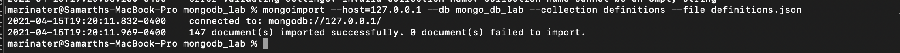
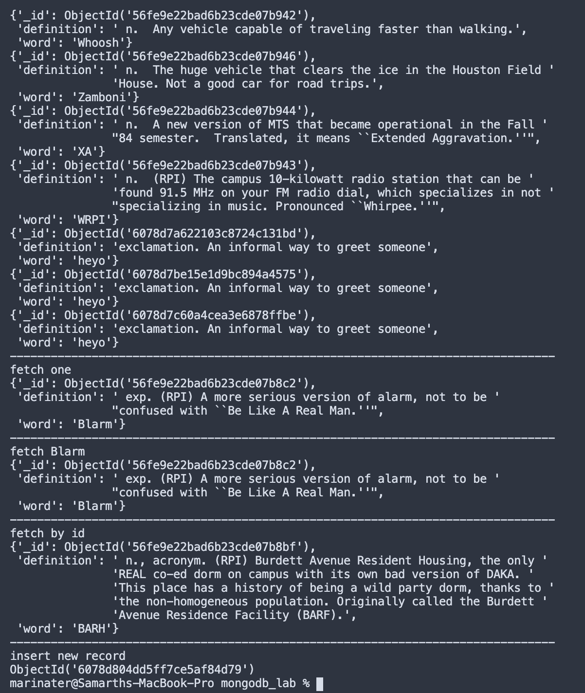

Samarth Patel

# Lab 9

## Checkpoint 1


## Checkpoint 2




## Checkpoint 3


## Checkpoint 4

```
from bson.objectid import ObjectId
from pprint import pprint
from pymongo import MongoClient

client = MongoClient()

if __name__ == '__main__':
    db = client.mongo_db_lab
    definitions = db.definitions

    print('fetch and print all')
    for definition in definitions.find():
        pprint(definition)
    print('-' * 80)

    print('fetch one')
    pprint(definitions.find_one())
    print('-' * 80)

    print('fetch Blarm')
    pprint(definitions.find_one({'word': 'Blarm'}))
    print('-' * 80)

    print('fetch by id')
    pprint(definitions.find_one({'_id': ObjectId('56fe9e22bad6b23cde07b8bf')}))
    print('-' * 80)

    print('insert new record')
    pprint(definitions.insert_one({'word': 'heyo', 'definition': 'exclamation. An informal way to greet someone'}).inserted_id)
```



## Checkpoint 5

```
from datetime import datetime
from bson.objectid import ObjectId
from pprint import pprint
from pymongo import MongoClient

client = MongoClient()

def random_word_requester():
    db = client.mongo_db_lab
    definitions = db.definitions


    random_aggregate = definitions.aggregate([{ '$sample': { 'size': 1 } }])
    random_word = next(random_aggregate)

    definitions.update_one({'_id': random_word['_id']}, {'$push': {'dates': datetime.now().isoformat() }})

    return f"{random_word['word']}:{random_word['definition']}"

if __name__ == '__main__':
    print(random_word_requester())

```


